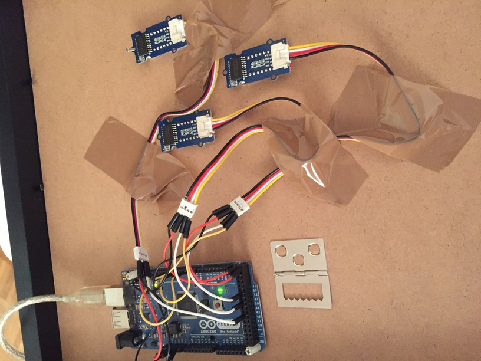

#Paris Dashboard ⚡️

🌀 Display the Paris Metro schedules 🚉 and the number of Velibs 🚲  (bicycle-system) available just near my home 😌.


## Requirements 👜

You need an Arduino board 💎 with PWM and Digital outputs.
As "4-digit 7-segment display" 💫 I bought 3x TM1637 (3*~8€), which requires 1x PWM intput (CLK), 1x Digital intput (DIO) and 5V input for each.




It's very easy to communicate 📢 with a TM1637.

```
#include "TM1637Display.h"
#define CLK_TM1637 7       
#define DIO_TM1637 42
TM1637Display tm1637(CLK_TM1637,DIO_TM1637);

void setup()
{
  tm1637.setBrightness(0x0f);
  tm1637.showNumberDec(1337,false,4,0);
}  
void loop() {
}
```
using this [library](https://github.com/avishorp/TM1637).

To communicate with my Arduino board, I use simply the ```screen``` shell function 💻.

## How it works ?

### Get RATP schedules 📋 and alerts 💩 in realtime 🌟

#### GTFS Data
You can parse the STIF GTFS ("*General Transit Feed Specification*") Data (CSV files) which contains all the STIF schedules for 3 next weeks available [here](opendata.stif.info/explore/dataset/offre-horaires-tc-gtfs-idf/table/) (70MB compressed, +500MB uncompressed). It's how the CityMapper app works.

It's a little bit difficult to understand how the data is linked 🔬, but you will find the *station-id* of your station in `stops.txt`, all the *stop schedules* (but not the full date, just hh:mm:ss) of your station in `stop_times.txt` (and all the trips), the *service-id* of each trip in `trips.txt` and finally *the date* (yyyymmdd, linked with that last data, in `calendar.txt` or `calendar_dates.txt`).

Example to get all schedules of your station in timestamp format :

```bash
MY_STATION_ID=XXX;
GOING_END_IDS=(XXX XXX); # must be an array, some line has 2 ends (13 for example)
COMING_END_IDS=(XXX); # same

grep ":$MY_STATION_ID," stop_times.txt| cut -d, -f1 -f3 >> selected-stops.txt;
sleep 1; # heavy

file="selected-stops.txt"
while IFS= read -r line
do
  TRIP_ID=$(echo $line | cut -d , -f1);
  TRIP_TIME=$(echo $line | cut -d , -f2);
  START_FROM=$(grep $TRIP_ID stop_times.txt |head -n 1 | cut -d , -f4 | cut -d : -f2);
  SERVICE_ID=$(grep $TRIP_ID trips.txt |cut -d , -f2);
  TRIP_DATE=$(grep "^$SERVICE_ID," calendar.txt | cut -d , -f9);
  if [[ "$TRIP_DATE" = "" ]]; then
      TRIP_DATE=$(grep "^$SERVICE_ID," calendar_dates.txt | cut -d , -f2);
  fi

  HOUR=$(echo $TRIP_TIME | cut -d : -f1);
  if [[ "${HOUR:0:1}" = "0" ]]; then
    HOUR=${HOUR:1};
  fi

  if [[ "$HOUR" -ge "24" ]]; then
    HOUR=$(($HOUR % 24));
    MINUTE=$(echo $TRIP_TIME | cut -d : -f2);
    TRIP_TIMESTAMP=$(date -d "$TRIP_DATE+1day $HOUR:$MINUTE:00" +%s);
  else
    TRIP_TIMESTAMP=$(date -d "$TRIP_DATE $TRIP_TIME" +%s);
  fi
done <"$file";
```

Help finding a *station-id* 🔎 :

>To get a station id, try a query like this (e.g with *Notre-Dame des Champs*, Line 12) :
```cat stops.txt |grep "Notre-Dame des Champs"```
*So Notre-Dame des Champs is 59516.*

>If you have multiple results, this example finding *Hôtel de Ville*, line 11 will help you :

>I will find the station id of *Mairie des Lilas* (one end of line 11, 59408)
>And execute this :
> ```grep "StopPoint:59408" stop_times.txt |head -n 1```

>I will get one trip_id (the first number) let's say : 6887160121185
>and execute :

>```grep 6887160121185 stop_times.txt```

>I have all the stops of this metro (12), and I know that *Hôtel de Ville* is just before *Châtelet* (the last one)
>So *Hôtel de Ville* is 59639. Check it :
>```grep "StopPoint:59639" stops.txt```
>If you have no result, you may have a typo problem.

>You need to find the station id of each end of your line, and your station.

To detect if an issue happened 🔶, you can use the [Twitter Streaming API](https://dev.twitter.com/streaming/overview) and get all the new tweets of one RATP line.
As they always use the same sentences, you will be able to detect if there is a problem or not, or when it has disappeared.

This example will print the new tweets from *TWEET\_ID\_RATP\_LINE* using [TwitterAPI](https://github.com/geduldig/TwitterAPI) (python)

```python
api = TwitterAPI(consumerKey,consumerSecret,accessToken, accessTokenSecret)

r = api.request('statuses/filter', {'follow': TWITTER_ID_RATP_LINE })

for item in r:
    print(item['text'] if 'text' in item else item)
```

When there is a new tweet, you have to check 👓 what is happening.
Check if it contains words that refer to an issue ( "colis", "ralenti", "interrompu") or an end of issue ("Retour", "reprise", "régulier" ) or other thing.

Those words can be found by analyzing what are the most used words by the community manager.

You can get the 💯x most used words in a file with :

```bash
tr -c '[:alnum:]' '[\n*]' < file.txt | sort | uniq -c | sort -nr | head  -100
```

*Just save a html page with a lot of tweets of one RATP line account and fire that query.*

They always use the same sentences 😊 :


#### Wap 💥
You can "grep" the RATP wap site, but it's clearly not adviced ❗️ -  the "CheckMyMetro" app got a lot of issues using this way with RATP.

### Get the number of available bikes 🚲 in a Velib station

✏️ Register an account [here](https://developer.jcdecaux.com) and get an API key 🔑.

You can get what you want with a simple query :

```bash
URL_VELIB="https://api.jcdecaux.com/vls/v1/stations/XXXX?contract=paris&apiKey=XXXXXXXX"
curl --silent "$URL_VELIB" 2>&1 \
| grep -E -o "\"available_bikes\":[0-9]+," | \
cut -d : -f2 | cut -d , -f1;
```


## About 👀

🙏 Special Thanks to  : Pupanimbas, Wyb0t, Mathemagie, FrançoisG, E-S, & difrrr.

If you have any question, open an issue.


## Images
