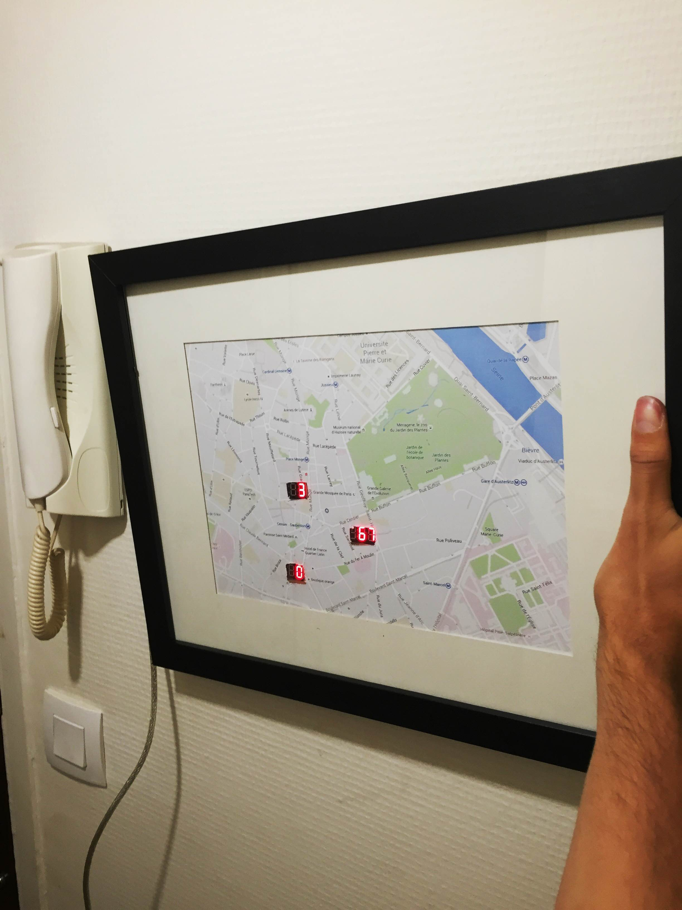
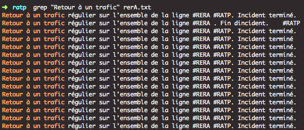

#Paris Dashboard ⚡️

🌀 Display the Paris Metro schedules 🚉 and the number of Velibs 🚲  (bicycle-system) available just near my home 😌.



## Requirements 👜

You need an Arduino board 💎 with PWM and Digital outputs.
As "4-digit 7-segment display" 💫 I bought 3x TM1637 (3*~8€), which requires 1x PWM intput (CLK), 1x Digital intput (DIO) and 5V input for each.


It's very easy to communicate 📢 with a TM1637.

```
#include "TM1637Display.h"
#define CLK_TM1637 7       
#define DIO_TM1637 42
TM1637Display tm1637(CLK_TM1637,DIO_TM1637);

void setup()
{
  tm1637.setBrightness(0x0f);
  tm1637.showNumberDec(1337,false,4,0);
}  
void loop() {
}
```
using this [library](https://github.com/avishorp/TM1637).

To communicate with my Arduino board, I use simply the ```screen``` shell function 💻.

## How it works ?

### Get RATP schedules 📋 and alerts 💩 in realtime 🌟

#### GTFS Data

Definition from Wikipedia (en)
> A GTFS feed is a collection of CSV files (with extension .txt) contained within a .zip file. Together, the related CSV tables describe a transit system's scheduled operations. The specification is designed to be sufficient to provide trip planning functionality, but is also useful for other applications such as analysis of service levels and some general performance measures. GTFS only includes scheduled operations, and does not include real-time information. 

##### Downloads

  - [STIF GTFS](http://opendata.stif.info/explore/dataset/offre-horaires-tc-gtfs-idf/table/) - all the STIF schedules for 3 next weeks (70MB compressed, +500MB uncompressed)
  - [RATP GTFS FULL](http://dataratp.opendatasoft.com/explore/dataset/offre-transport-de-la-ratp-format-gtfs/) - all the annual schedules 
  - [RATP GTFS LINES](http://dataratp.download.opendatasoft.com/RATP_GTFS_LINES.zip) - a smaller package, divided by line 

It's a little bit difficult to understand how the data is linked 🔬, but you will find the *station-id* of your station in `stops.txt`, all the *stop schedules* (but not the full date, just hh:mm:ss) of your station in `stop_times.txt` (and all the trips)..

##### Parser 

I recommend to use a parser to aggregate the data. I extracted them with ["Node-GTFS"](https://github.com/brendannee/node-gtfs) which contains a lot of methods to query for agencies, routes, stops and times. But you can easily find another one in another language.


To detect if an issue happened 🔶, you can use the [Twitter Streaming API](https://dev.twitter.com/streaming/overview) and get all the new tweets of one RATP line.
As they always use the same sentences, you will be able to detect if there is a problem or not, or when it has disappeared.

This example will print the new tweets from *TWEET\_ID\_RATP\_LINE* using [TwitterAPI](https://github.com/geduldig/TwitterAPI) (python)

```python
api = TwitterAPI(consumerKey,consumerSecret,accessToken, accessTokenSecret)

r = api.request('statuses/filter', {'follow': TWITTER_ID_RATP_LINE })

for item in r:
    print(item['text'] if 'text' in item else item)
```

When there is a new tweet, you have to check 👓 what is happening.
Check if it contains words that refer to an issue ( "colis", "ralenti", "interrompu") or an end of issue ("Retour", "reprise", "régulier" ) or other thing.

Those words can be found by analyzing what are the most used words by the community manager.

You can get the 💯x most used words in a file with :

```bash
tr -c '[:alnum:]' '[\n*]' < file.txt | sort | uniq -c | sort -nr | head  -100
```

*Just save a html page with a lot of tweets of one RATP line account and fire that query.*

They always use the same sentences 😊 :



Twitter accounts :

- [RER A](https://twitter.com/RERA_RATP)
- [RER B](https://twitter.com/RERB)
- [RER C](https://twitter.com/RERC_SNCF)
- [RER D](https://twitter.com/RERD_SNCF)
- [RER E](https://twitter.com/RERE_SNCF)
- [Line 1](https://twitter.com/Ligne1_RATP)
- [Line 2](https://twitter.com/Ligne2_RATP)
- [Line 3](https://twitter.com/Ligne3_RATP)
- [Line 4](https://twitter.com/Ligne4_RATP)
- [Line 5](https://twitter.com/Ligne5_RATP)
- [Line 6](https://twitter.com/Ligne6_RATP)
- [Line 7](https://twitter.com/Ligne7_RATP)
- [Line 8](https://twitter.com/Ligne8_RATP) 
- [Line 9](https://twitter.com/Ligne9_RATP)
- [Line 10](https://twitter.com/Ligne10_RATP)
- [Line 11](https://twitter.com/Ligne11_RATP)
- [Line 12](https://twitter.com/Ligne12_RATP)
- [Line 13](https://twitter.com/Ligne13_RATP)
- [Line 14](https://twitter.com/Ligne14_RATP)
- [Tram 1](https://twitter.com/T1_RATP)
- [Tram 2](https://twitter.com/T2_RATP)
- [Tram 3A](https://twitter.com/T3a_RATP)
- [Tram 3B](https://twitter.com/T3b_RATP)
- Tram 4 (no account)
- [Tram 5](https://twitter.com/T5_RATP) 
- [Tram 6](https://twitter.com/T6_RATP)
- [Tram 7](https://twitter.com/T7_RATP)
- [Tram 8](https://twitter.com/T8_RATP)


#### Wap 💥
You can "grep" the RATP wap site, but it's clearly not adviced ❗️ -  the "CheckMyMetro" app got a lot of issues using this way with RATP.

```bash
curl --silent -A "Mozilla/5.0" "http://wap.ratp.fr/{YOURURI}" 2>&1 | grep -E -o "([0-9]+) mn"
```


### Get the number of available bikes 🚲 in a Velib station

✏️ Register an account [here](https://developer.jcdecaux.com) and get an API key 🔑.

You can get what you want with a simple query (edit *STATIONID* and *KEY*) :

```bash
URL_VELIB="https://api.jcdecaux.com/vls/v1/stations/{STATIONID}?contract=paris&apiKey={KEY}"
curl --silent "$URL_VELIB" 2>&1 \
| grep -E -o "\"available_bikes\":[0-9]+," | \
| awk -F ':' '{ print $2 }' | cut -d , -f1;
```


## About 👀

🙏 Special Thanks to  : Pupanimbas, Wyb0t, Mathemagie, FrançoisG, E-S, & difrrr.

If you have any question, open an issue.


